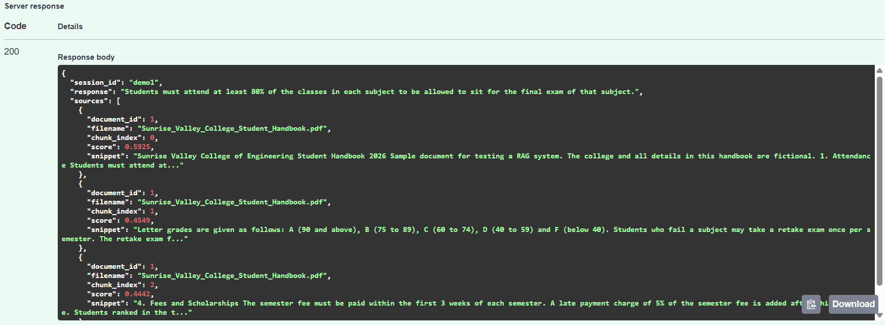
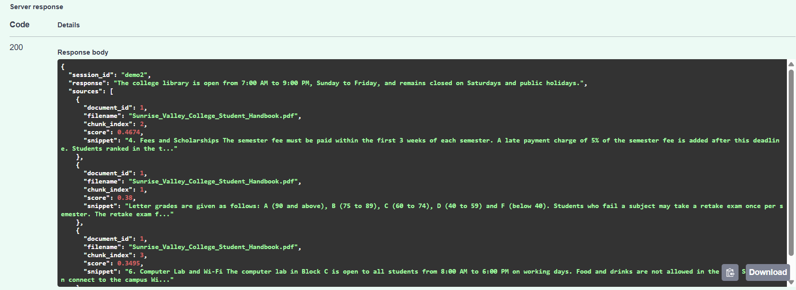
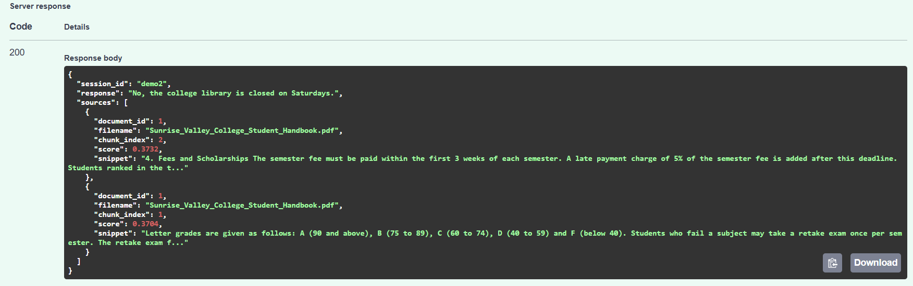
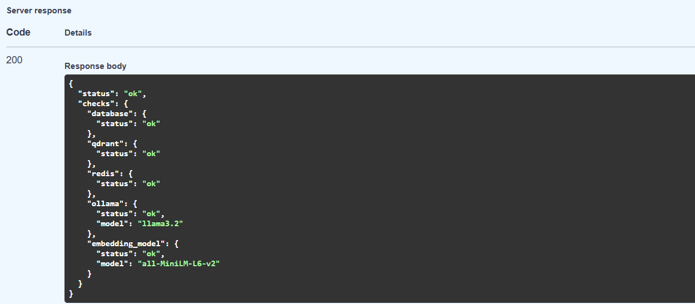
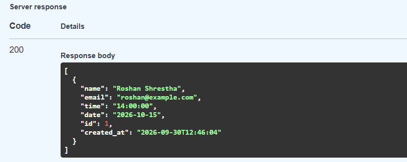

# Customizable Conversational RAG

A FastAPI backend that lets you chat with your own documents. Upload a PDF or text file, ask questions in a normal conversation, and get answers with the exact passages they came from.

It is customizable at every step: choose how each document is split (by paragraph or fixed size, with your own chunk size and overlap), choose how many results to retrieve and which documents to search for each question, and change the LLM, embedding model or minimum match score in the settings. It runs fully locally, so documents never leave your machine.

## The Problem

General chatbots can't answer questions about your own documents, and simple RAG demos break quickly in real use:

- **Bad chunks:** documents are split without regard to meaning or the embedding model's limit, so text gets cut off or topics get mixed.
- **Follow-up questions fail:** "Is it open on Saturday?" means nothing to a search engine without the previous message.
- **No way to verify answers:** without sources, you can't tell a real answer from a made-up one.

## Features

- **Configurable chunking:** paragraph-based or fixed-size, measured in the embedding model's tokens, with chunk size and overlap settable per upload
- **Conversational search:** understands follow-up questions by using earlier messages, e.g. turning "Is it open on Saturday?" into "Is the library open on Saturday?" before searching
- **Answers with sources:** every answer lists the file, chunk and similarity score it used
- **Filters:** search specific documents or a chunking strategy, adjust `top_k`, and skip weak matches below a similarity threshold
- **Chat memory** in Redis, with automatic expiry
- **Interview booking in the chat:** the LLM extracts the details, Pydantic validates them, and missing details are collected over several messages
- **Production basics:** Docker Compose, a `/health` endpoint, clear errors when a service is down, and 90+ tests

## How It Works

```
Upload:  PDF/TXT → extract text → chunk → embed (all-MiniLM-L6-v2) → store in Qdrant
Chat:    question → rewrite follow-up → search Qdrant → LLM (llama3.2 via Ollama) → answer + sources
```

**Tech stack:** FastAPI · Qdrant · Redis · SQLite · sentence-transformers · Ollama · Docker

## Evaluation

Which chunking works best? I tested 5 configurations on 31 questions over 3 sample documents, measuring how often the correct passage was ranked first (**Hit@1**), how often it was in the top 3 (**Hit@3**), and how high it ranked on average (**MRR@5**, where 1.0 is perfect).

| Configuration | Chunks | Avg tokens | Hit@1 | Hit@3 | MRR@5 | p50 ms | p95 ms |
|---|---:|---:|---:|---:|---:|---:|---:|
| Fixed, 64 tokens (overlap 12) | 44 | 52 | 0.65 | 0.90 | 0.783 | 10.6 | 12.7 |
| Fixed, 128 tokens (overlap 25) | 23 | 108 | 0.68 | 1.00 | 0.833 | 10.9 | 12.6 |
| Fixed, 254 tokens (overlap 50) | 11 | 227 | 0.84 | 0.97 | 0.910 | 11.1 | 13.5 |
| **Paragraph, 128 tokens** | **25** | **88** | **0.94** | **1.00** | **0.968** | **10.8** | **11.4** |
| Paragraph, 254 tokens | 11 | 200 | 0.77 | 0.97 | 0.872 | 10.4 | 13.1 |

**Chunks** is how many pieces the 3 documents were split into, and **Avg tokens** is the average size of a piece.

**Result:** paragraph chunking at 128 tokens found the right passage first 94% of the time, versus 68% for fixed chunks of the same size, because each chunk stays on one topic. Larger chunks help fixed chunking but hurt paragraph chunking, because unrelated sections get merged. Search takes about 11 ms per query on CPU.

*This is a small benchmark, so treat the numbers as a comparison between settings, not absolute quality.* Full results: [eval/results.md](eval/results.md)

## Quickstart

```bash
git clone https://github.com/roshanstha01/customizable-conversational-rag.git
cd customizable-conversational-rag
docker compose up --build
```

Then open **http://localhost:8000/docs** to try the API, or **/health** to check that every service is running.

Run the tests:

```bash
pip install -r requirements-dev.txt
pytest
```
## Configuration

| Component | Default | Setting |
|---|---|---|
| LLM (answers, question rewriting, booking) | `llama3.2` via Ollama | `LLM_MODEL` |
| Embedding model | `all-MiniLM-L6-v2` (384 dimensions, 256-token limit) | `EMBEDDING_MODEL` |
| Vector database | Qdrant (cosine similarity) | `QDRANT_HOST`, `QDRANT_PORT` |
| Chat memory | Redis, kept for 24 hours, max 50 messages | `CHAT_HISTORY_TTL_SECONDS`, `CHAT_HISTORY_MAX_MESSAGES` |
| Chunk size / overlap | `200` / `40` tokens | `CHUNK_SIZE`, `CHUNK_OVERLAP` |
| Chunks retrieved per question | `5` (max 20) | `TOP_K`, `MAX_TOP_K` |
| Minimum similarity score | `0.25` | `MIN_SIMILARITY_SCORE` |
| Booking time zone | `Asia/Kathmandu` | `TIMEZONE` |
| Upload limit | `10` MB | `MAX_UPLOAD_SIZE_MB` |

All settings can be changed in a `.env` file (see [.env.example](.env.example)). Chunk size and overlap can also be set per upload.

## Screenshots

**Question:** "What is the minimum attendance to sit for the final exam?"
The answer comes with the document passages it was built from (`sources`).


**Follow-up question:** first "What are the library opening hours?", then "Is it open on Saturday?"
The second question never mentions the library, but the answer is still correct.



**Health check:** all services running


**Booking an interview over several messages**

    User: I want to book an interview. My name is Roshan Shrestha.
    Bot:  To book your interview I still need your email address, the date (e.g. 2026-10-05) and the time (e.g. 9:00 or 2pm).
    User: roshan@example.com
    Bot:  To book your interview I still need the date (e.g. 2026-10-05) and the time (e.g. 9:00 or 2pm).
    User: 2026-10-15 at 2pm
    Bot:  Your interview is booked for Thursday, October 15, 2026 at 14:00 under Roshan Shrestha (roshan@example.com).

The booking saved in the database (`GET /api/bookings`). "2pm" was converted to `14:00:00`:



Built by [Roshan Shrestha](https://github.com/roshanstha01)
