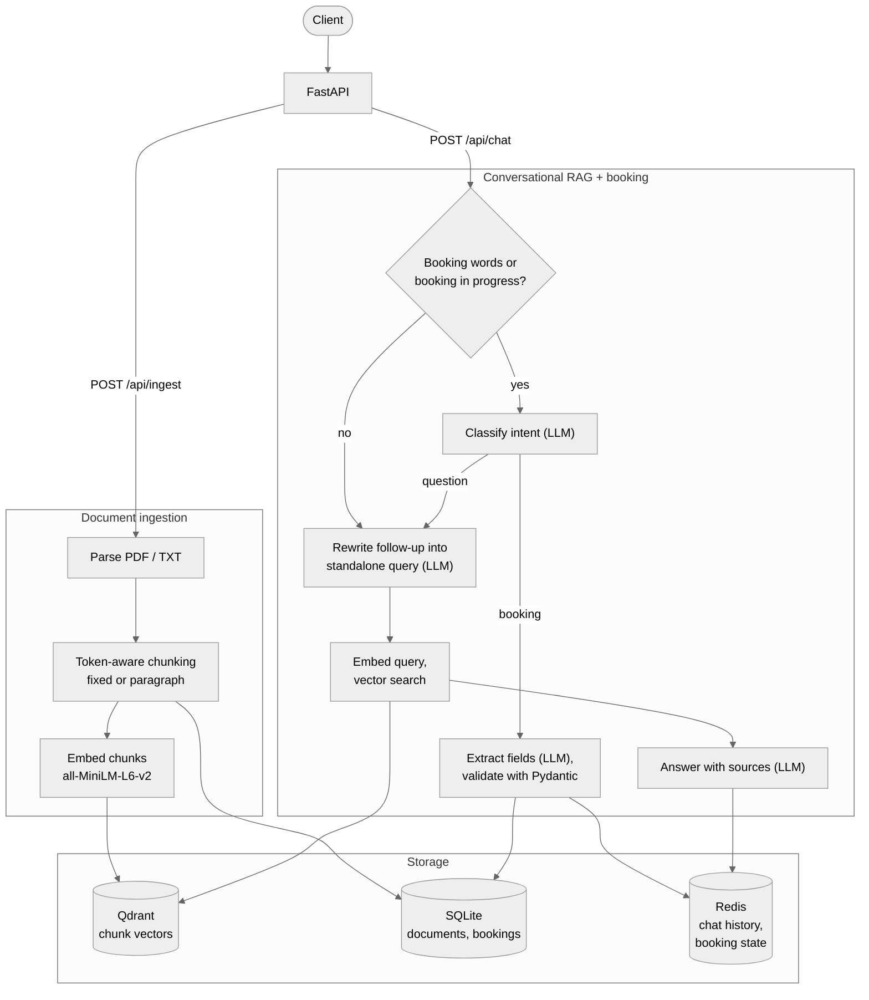

# Customizable Conversational RAG

A FastAPI backend for chatting with your own documents. Upload PDFs or text files, choose how they are chunked, and ask questions in a multi-turn conversation. Answers cite the passages they were built from. The same chat endpoint can also book interviews: it recognises booking requests, collects the details over several messages and validates them before saving.

Everything runs locally: a sentence-transformers embedding model, Qdrant for vector search, Redis for conversation memory, SQLite for metadata and an LLM served by Ollama. No LangChain; the retrieval pipeline is written directly against these components.

## The Problem

Generic chatbots can't answer questions about a team's own documents, and naive RAG demos break in ways that matter once real documents and real conversations are involved:

- **Chunking ignores the model.** Character-based chunks overflow the embedding model's token limit and get silently truncated, and PDF text (one line per visual line) breaks paragraph splitting.
- **Follow-up questions fail.** "What language is it written in?" contains nothing to search for without the previous turn.
- **Answers are unverifiable.** Without sources, users can't tell a grounded answer from a hallucinated one.
- **Actions are brittle.** Keyword matching sends "What's the interview schedule in the doc?" to a booking flow, and one-shot regex extraction fails on "tomorrow at 2pm".

This project addresses each of these and measures retrieval quality with a small evaluation harness.

## Features

- **Document ingestion** of `.pdf` and `.txt` files with two token-aware chunking strategies (fixed-size with overlap, and paragraph-based), configurable per upload
- **Conversational RAG** with LLM query rewriting for follow-ups, metadata filters (`document_ids`, `chunking_strategy`), adjustable `top_k`, a minimum similarity score and cited sources
- **Chat memory** in Redis with a TTL and a length cap
- **Interview booking** inside the chat: LLM intent classification, JSON field extraction, Pydantic validation, multi-turn collection of missing details and double-booking prevention
- **Document management:** list and delete (removes the SQLite row, vectors and uploaded file)
- **Operations:** Docker Compose stack, `/health` endpoint, structured logging, clear `503` errors when a dependency is down
- **Quality:** 90+ offline pytest tests and a retrieval evaluation comparing chunking configurations

## Architecture



Steps marked (LLM) call the local LLM through Ollama (`llama3` by default).

Services are created once in the FastAPI lifespan (so the embedding model loads a single time) and injected into routes as dependencies. Each external call is wrapped so that connection failures surface as `503 <service> is unavailable` rather than stack traces.

## Design Decisions and Trade-offs

**Chunk by the embedding model's tokens, on sentence boundaries.** `all-MiniLM-L6-v2` reads at most 256 tokens, and anything beyond that is silently dropped. The chunker counts tokens with the model's own tokenizer, packs whole sentences, carries overlap as whole sentences, and only hard-splits a single sentence that is longer than the limit (slicing the original text by token offsets, so casing is preserved). A final check re-splits anything still over the limit. *Trade-off:* tokenizing costs more than counting characters, but it is still fast compared with embedding.

**PDF-aware paragraph detection.** PyMuPDF returns one line per visual line, with no blank lines between paragraphs. A line break is treated as a paragraph boundary only after sentence-ending punctuation, and before chunking the text is normalised: ligatures are expanded (PDFs often return `fi` as one character) and words hyphenated across lines are rejoined. *Trade-off:* this is a heuristic. A heading without punctuation merges into the next paragraph, and a compound like `well-\nknown` becomes `wellknown`.

**Rewrite follow-ups before retrieval.** The LLM turns the latest message and recent history into a standalone query, which is what gets embedded; the answer is still generated for the user's original words. The first message of a session skips this step. *Trade-off:* an extra LLM call per follow-up. The prompt explicitly forbids answering, because llama3 otherwise replied "Rust" instead of rewriting the question.

**Minimum similarity score.** Chunks below `MIN_SIMILARITY_SCORE` (default 0.25) are dropped, so off-topic questions get "I could not find this in the document" instead of an answer built from irrelevant context. *Trade-off:* the right threshold depends on the embedding model and the corpus.

**Booking: a cheap gate, then an LLM, then strict validation.** Messages go to the intent classifier only if they contain booking words (book, schedule, interview, appointment, meeting) or a booking is already in progress; everything else goes straight to RAG with no extra LLM call. Extraction uses Ollama's JSON mode, and every value must be backed by the message (names and emails must appear verbatim), because llama3 invented today's date for "Book an interview please". Pydantic then validates the email, parses times such as `9:00`, `14:30` and `2pm`, and requires a date and time in the future (in the `TIMEZONE` setting). Partial bookings are stored in Redis so details can arrive over several turns. A unique `(date, time)` index backs up the application-level double-booking check. *Trade-off:* the keyword gate can miss unusual phrasings, such as "can we talk Tuesday?", in exchange for one fewer LLM call on most messages.

**Degrade gracefully.** The API starts even if Qdrant is down, retries the collection setup on the next request, and returns `503` with the name of the missing service. `/health` checks each dependency and whether the LLM model has been pulled. If indexing fails, the document row and uploaded file are removed so nothing is left half-ingested.

**Keep the stack small.** SQLite and a local LLM keep the project easy to run on one machine. *Trade-offs:* SQLite serialises writes, and point IDs are `document_id * 100000 + chunk_index`, which caps a document at 100,000 chunks. Neither is a problem at this scale, but both would change for a multi-user deployment (Postgres, UUID point IDs).

## Evaluation

`eval/` compares chunking configurations on 31 questions (14 phrased like the source text, 17 paraphrased) over three sample documents: an HR handbook, a vector search primer and a solar inverter manual rendered as a PDF. Each question has an `expected` phrase, and a result is a hit when a retrieved chunk from the right document contains it. Indexing and search use the app's own chunker, embedding service and vector store.

| Configuration | Chunks | Avg tokens | Hit@1 | Hit@3 | Hit@5 | MRR@5 | p50 ms | p95 ms |
|---|---:|---:|---:|---:|---:|---:|---:|---:|
| `fixed-64-o12` | 44 | 52 | 0.65 | 0.90 | 0.97 | 0.783 | 10.6 | 12.7 |
| `fixed-128-o25` | 23 | 108 | 0.68 | 1.00 | 1.00 | 0.833 | 10.9 | 12.6 |
| `fixed-254-o50` | 11 | 227 | 0.84 | 0.97 | 1.00 | 0.910 | 11.1 | 13.5 |
| **`paragraph-128`** | 25 | 88 | **0.94** | **1.00** | **1.00** | **0.968** | 10.8 | 11.4 |
| `paragraph-254` | 11 | 200 | 0.77 | 0.97 | 1.00 | 0.872 | 10.4 | 13.1 |

`fixed-<tokens>-o<overlap>` and `paragraph-<max tokens>`. Latency is query embedding plus search on CPU with in-memory Qdrant. Full output: [eval/results.md](eval/results.md).

**What it shows:** paragraph chunking at 128 tokens ranked the right passage first for 94% of questions, against 68% for fixed chunks of the same size. The likely reason is that paragraphs keep each topic (one policy, one group of error codes) together, while fixed-size chunks mix neighbouring topics or cut them in half. Larger chunks help fixed chunking (Hit@1 rises from 0.65 to 0.84) but hurt paragraph chunking, where 254-token chunks merge unrelated sections. The only question missed entirely was a paraphrase about HNSW's `ef` setting, with 64-token chunks.

**Caveats:** this is a small, self-written benchmark. With only 11–44 chunks in total, Hit@5 saturates, so Hit@1 and MRR are the informative columns. The questions were written by the same author as the documents. The numbers show relative differences between configurations on this corpus, not absolute quality.

```bash
python -m eval.run_eval                          # in-memory Qdrant, writes eval/results.md
python -m eval.run_eval --qdrant-host localhost  # against a running Qdrant server
```

To add questions, append lines to `eval/questions.jsonl` (`id`, `doc`, `type`, `question`, `expected`). The runner checks that every `expected` phrase appears exactly once in its document.

## Quickstart (Docker Compose)

```bash
git clone https://github.com/roshanstha01/ai-ml-intern-task.git
cd ai-ml-intern-task
docker compose up --build
```

This starts the API on port 8000 with Qdrant, Redis and Ollama, and pulls the LLM (`llama3` by default; set `LLM_MODEL` to change it). The first start takes a while because it downloads the models. Then:

- Swagger UI: http://localhost:8000/docs
- Health: http://localhost:8000/health

### Running locally without Docker

```bash
python -m venv venv
source venv/bin/activate          # Windows: venv\Scripts\activate
pip install -r requirements.txt
cp .env.example .env               # optional; every setting has a default

docker run -d -p 6333:6333 qdrant/qdrant
docker run -d -p 6379:6379 redis
ollama pull llama3

uvicorn app.main:app --reload
```

## Configuration

All settings are environment variables (or `.env`). See [.env.example](.env.example) for the full list.

| Setting | Default | Purpose |
|---|---|---|
| `EMBEDDING_MODEL` | `all-MiniLM-L6-v2` | sentence-transformers model |
| `LLM_MODEL` | `llama3` | Ollama model for answers, rewriting and booking |
| `CHUNK_SIZE` / `CHUNK_OVERLAP` | `200` / `40` | Default chunking, in tokens (capped at the model limit) |
| `TOP_K` / `MAX_TOP_K` | `5` / `20` | Chunks retrieved per question |
| `MIN_SIMILARITY_SCORE` | `0.25` | Drop weaker matches |
| `CHAT_HISTORY_TTL_SECONDS` / `CHAT_HISTORY_MAX_MESSAGES` | `86400` / `50` | Redis chat memory |
| `BOOKING_STATE_TTL_SECONDS` | `1800` | How long a half-finished booking is remembered |
| `TIMEZONE` | `Asia/Kathmandu` | Time zone for booking dates and times |
| `MAX_UPLOAD_SIZE_MB` | `10` | Upload limit |

## API Examples

**Ingest a document**

```bash
curl -X POST http://localhost:8000/api/ingest \
  -F "file=@eval/docs/helio_h5_manual.pdf" \
  -F "chunking_strategy=paragraph" \
  -F "chunk_size=128"
```

```json
{
  "document_id": 1,
  "filename": "helio_h5_manual.pdf",
  "file_type": ".pdf",
  "chunking_strategy": "paragraph",
  "chunk_size": 128,
  "chunk_overlap": 0,
  "total_chunks": 8,
  "message": "Document ingested successfully."
}
```

**Ask a question, then a follow-up**

```bash
curl -X POST http://localhost:8000/api/chat -H "Content-Type: application/json" \
  -d '{"session_id": "demo", "message": "What does error E07 mean?"}'

curl -X POST http://localhost:8000/api/chat -H "Content-Type: application/json" \
  -d '{"session_id": "demo", "message": "How do I fix it?", "top_k": 3}'
```

Response to the first question (the `response` text depends on the LLM; the source is the real top match):

```json
{
  "session_id": "demo",
  "response": "E07 means the battery is over-temperature: it is too hot to charge or discharge safely.",
  "sources": [
    {
      "document_id": 1,
      "filename": "helio_h5_manual.pdf",
      "chunk_index": 4,
      "score": 0.5545,
      "snippet": "Status Lights A steady green LED means the inverter is connected to the grid and operating normally. A blinking green LED means the battery is charging. A steady red LED indicates a fault;..."
    }
  ]
}
```

The follow-up "How do I fix it?" is rewritten into a standalone query about error E07 before searching.

**Restrict the search**

```json
{"session_id": "demo", "message": "What is the warranty?", "document_ids": [1], "chunking_strategy": "paragraph"}
```

**Book an interview over several messages** (a real run with llama3)

```
User: I'd like to book an interview. My name is Priya Sharma.
Bot:  To book your interview I still need your email address, the date (e.g. 2026-10-05) and the time (e.g. 9:00 or 2pm).
User: priya.sharma@example.com
Bot:  To book your interview I still need the date (e.g. 2026-10-05) and the time (e.g. 9:00 or 2pm).
User: Let's do 2026-10-14 at 3:30pm
Bot:  Your interview is booked for Wednesday, October 14, 2026 at 15:30 under Priya Sharma (priya.sharma@example.com).
```

Questions asked mid-booking are still answered from the documents, "cancel" abandons the booking, and a slot that is already taken is refused.

**Other endpoints**

| Method | Path | Description |
|---|---|---|
| `GET` | `/api/documents` | List documents (metadata only) |
| `DELETE` | `/api/documents/{id}` | Delete a document, its vectors and its file |
| `GET` | `/api/bookings` | List bookings |
| `GET` | `/health` | Status of the database, Qdrant, Redis, Ollama and the embedding model |

## Running Tests

```bash
pip install -r requirements-dev.txt
pytest
```

The suite runs offline: Qdrant, Redis, the LLM and the embedding model are replaced with in-process fakes. It covers the chunkers (including a check with the real MiniLM tokenizer when it is cached locally), booking parsing, validation and multi-turn flows with a mocked LLM, and the full ingest-to-chat API flow.

## Project Structure

```
app/
  main.py                  FastAPI app, lifespan, routers
  config.py                Settings (pydantic-settings)
  dependencies.py          Shared services for routes
  errors.py                503 mapping and generic 500 handler
  api/                     ingest, chat, documents, bookings, health
  services/
    chunking.py            Token-aware fixed / paragraph chunking
    rag_service.py         Query rewriting, retrieval, answer generation
    booking_service.py     Intent gate, LLM extraction, multi-turn booking
    booking_validation.py  Pydantic booking model, date/time parsing
    vector_store.py        Qdrant wrapper (filters, score threshold, delete)
    memory_service.py      Redis chat history and session state
    embedding_service.py, llm_service.py, document_parser.py
  db/                      SQLAlchemy models and schema setup
eval/                      Sample docs, question set, evaluation runner, results
tests/                     pytest suite
```

## Screenshots

These screenshots are from the first version of the API, before sources, query rewriting and the LLM booking flow were added. The requests are the same, but current responses also include a `sources` list, and the booking reply is worded differently.

**Swagger UI: the document ingestion endpoint**


**Uploading `sample.txt` with the fixed chunking strategy**


**Ingestion response**


**The ingested document in the SQLite `documents` table**


**Asking a question: "What is artificial intelligence?"**


**The answer generated from the uploaded document**


**Follow-up in the same session: "Can you explain that in simpler terms?"**


**The follow-up answer uses the conversation history**


**Booking an interview with all details in one message**


**Booking confirmation (first-version wording)**


**The saved booking in the SQLite `bookings` table**


---

Built by [Roshan Shrestha](https://github.com/roshanstha01).
